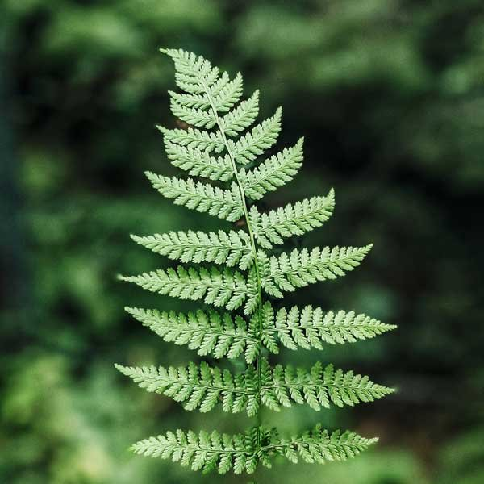

[](https://classroom.github.com/a/uVynQggK)
# Exercício 01 - Fractais em todos os lugares

## Objetivos:

1. Entender melhor o processo de construção de figuras geométricas a partir de primitivas 2D simples como linhas e pontos;
2. Compreender a relação entre processos construtivos geométricos e formas;
3. Dominar o processo de desenho de primitivas 2D utilizando o *Three.JS*.

## Motivação:

A natureza é repleta de formas geométricas interessantes. Na Figura 1 vemos dois exemplos de formas naturais que apresentam propriedades geométrica instigantes. Tanto no brocoli quanto na folha de samanbaia podemos notar propriedades geométricas/matemáticas: simetrias, razões de proporção e principalmente a auto-similaridade, onde partes do objeto guardam similiridade com o todo.   

 

*Figura 1 - Exemplos de fractais na natureza: uma folha de samambaia e um brocolis romanesco.* 

Em 1975 o matemático frances *Benoît Mandelbrot* criou o termo **Fractal** [1] [2] para caracterizar esse tipo de forma geométrico. *Mandelbrot* ficou conhecido por seus estudos sobre a geometria fractal, em particular do chamado **Mandelbrot Set** [2]. Esse conjunto, visualizado na Figura 2, é um dos mais conhecidos fractais, que demonstram de forma clara a propriedade de auto-similiaridade.

 

*Figura 2 - Explorando a propriedade de auto-similiradade do **Mandelbrot Set**.* 

Explorando a propriedade de auto-similaridade é possível criar um algoritmo para construí-los. A partir de uma sequencia de operações matemáticas que gerem "cópias" em menor escala e as combine de forma iterativa é possível, no limite, gerar uma forma auto-similar. Portanto, dada uma forma inicial, aplicando contrações e reposicionamentos em sequencia, no limite temos o fractal. É óbvio que essas operações matemáticas devem seguir certas propriedades, sendo a principal garantir um sequencia convergente [1]. 

Um outro exemplo de fractal bastante conhecido, e de construção mais intuitiva, é o **Triangulo de Sierpinsky**. A Figura 3 (esq.) mostra o seu processo construtivo: a partir de um triangulo inicial, 3 cópias reduzidas e deslolcadas são geradas, de tal sorte que produzam um espaço vazio no centro do triangulo. O processo é aplicado novamente a cada um dos 3 novos triangulos, e repetido iterativamente, como mostra a Figura 3 (esq.), convergindo no limite para uma curva que representa o fractal. Essa curva, diferentemente das curvas da geometria terá uma dimensão fracionária, dai o nme **fractal**. 

  

*Figura 3 - Triangulo de Sierpinsky: a cada passo do processo de construção, 3 cópias de tamanho 1/3 do objeto anterior são gerados, e posicionados de forma a gerar um "buraco" no centro do triângulo.* 

A Figura 4 mostra que mesmo que o objeto inicial seja diferente, aplicadas as mesmas operações, o fractal será sempre o mesmo. Esse conjunto de pontos para o qual o fractal converge é chamado de **atrator**. 


*Figura 4 - Independente do objeto inicial, o processo de geração leva no limite para a mesmo conjunto de pontos: o seu atrator.* 

As transformações matemáticas que geram o fractal podem ser definidas de diversas formas, entre elas os chamados *Iterated Functions Systems* (**Sistemas de Funções Iteradas**) ou **IFS**. Sua representação matemática é bem simples e equivale a uma transformação linear afim da forma: 

,

onde a matriz representa a parte linear da transformação, aplicada ao vetor de coordenadas *(x, y)*, enquanto que a parte afim é representada pelo vetor *[e f]* . Os valores específicos para a geração do **Triangulo de Sierpinsky**, que promovem a redução em 1/3 da figura inicial e seu deslocamento para os 3 extremos do triangulo são: 

.

Os *IFS* podem ser descritos por uma tabela onde cada linha equivale a uma transformação *fi(**x**)* e seus coefienentes descritos em cada uma de suas colunas, como na Tabela I a seguir.

**Tabela I - Coeficientes do IFS do Triangulo de Sierpinsky.** 
| f |  a  |  b  |  c  |  d  |   e  |  f |
|---|-----|-----|-----|-----|------|---------|
| 1 | 0.5 | 0.0 | 0.0 | 0.5 | 0.00 | 0.0 | 
| 2 | 0.5 | 0.0 | 0.0 | 0.5 | 0.50 | 0.0 | 
| 3 | 0.5 | 0.0 | 0.0 | 0.5 | 0.25 | sqrt(3)/4 | 

Variando os parâmetros do *IFS* podemos obter diversos outros tipos de fractais. Vamos experimentar? 

## Exercícios:

1. Considere a descrição do processo de geração do **Triangulo de Sierpinsky** descrito acima. Construa uma aplicação utilizando o *framework Three.JS*, que implementa as transformações do *IFS* descrito na **Tabela I**.
2. Acrescente uma *GUI* a aplicação de tal forma que seja possível ajustar qual o nĩvel de iterações será aplicado no fractal.
3. Generalize a aplicação desenvolvida para visualizar os *IFS* descritos nas **Tabelas** de **II** à **VI**.
4. Um processo alternativo e relativamente menos custoso de geração de um fractal é baseado no que a literatura chama de **algoritmo de iteração randômica**. Diferente do algoritmo **determinístico** descrito anteriormente, o algoritmo randomico considera que é possível gerar uma sequencia de pontos que, aplicando de forma iterada o **IFS**, converge para o atrator do fractal. A Figura 5 mostra esse processo, descrito no algoritmo a seguir:

```
Escolha um ponto inicial p (de preferencia dentro da figura inicial);
fractal = {}; 
Repita
   Sorteie uma função i do IFS -> fi;
   Calcule p_novo = fi(p);
   fractal = fractal + p;
   p = p_novo;
até que um numero máximo de iterações seja alcançado. 
```
Para uma quantidade grande de pontos (> 100.000) o conjunto fractal será capaz de aproximar de maneira satisfatória o fractal, tal qual o algoritmo deterministico. 

Implemente esse algoritmo e compare seu desempenho e qualidiade visual com o algoritmo determinístico, considerando todos os **IFS** da atividade. 


*Figura 5 - A partir de um ponto e aplicando de forma randomica mas iterada as funções do **IFS** é possível gerar uma sequencia de pontos que converge para o atrator do fractal.* 


**Tabela II** 
| f |  a  |  b  |  c  |  d  |   e  |  f |
|---|-----|-----|-----|-----|------|---------|
| 1 |  0.00 | 0.00 |  0.00 | 0.16 | 0.00 | 0.00|  
| 2 |  0.58 | 0.04 | -0.04 | 0.85 | 0.00 | 0.16|  
| 3 |  0.20 | 0.26 |  0.23 | 0.22 | 0.00 | 0.16|  
| 4 | -0.15 | 0.28 |  0.26 | 0.24 | 0.00 | 0.04|  

**Tabela III** 
| f |  a  |  b  |  c  |  d  |   e  |  f |
|---|-----|-----|-----|-----|------|---------|
| 1 |  0.00 |  0.00 |  0.00 | 0.16 | 0.00 | 0.00 |  
| 2 |  0.75 |  0.04 | -0.04 | 0.85 | 0.00 | 0.16 |  
| 3 |  0.20 | -0.26 |  0.23 | 0.22 | 0.00 | 0.16 |  
| 4 | -0.15 |  0.28 |  0.26 | 0.24 | 0.00 | 0.04 |  

**Tabela IV** 
| f |  a  |  b  |  c  |  d  |   e  |  f |
|---|-----|-----|-----|-----|------|---------|
| 1 |  0.01 |  0.00 |  0.00 |  0.45 | 0.00 | 0.00 |  
| 2 | -0.01 |  0.00 |  0.00 | -0.45 | 0.00 | 0.40 |  
| 3 |  0.42 | -0.42 |  0.42 |  0.42 | 0.00 | 0.40 |  
| 4 |  0.42 |  0.42 | -0.42 |  0.42 | 0.00 | 0.40 |  

**Tabela V** 
| f |  a  |  b  |  c  |  d  |   e  |  f |
|---|-----|-----|-----|-----|------|---------|
| 1 |  0.382 |  0.000 |  0.00, |  0.382 | 0.309 | 0.570 |  
| 2 |  0.118 | -0.363 |  0.363 |  0.118 | 0.363 | 0.330 |  
| 3 |  0.118 |  0.363 | -0.363 |  0.118 | 0.518 | 0.694 |  
| 4 | -0.309 | -0.224 |  0.224 | -0.309 | 0.607 | 0.309 |  
| 5 | -0.309 |  0.224 | -0.224 | -0.309 | 0.701 | 0.533 |  
| 6 |  0.382 |  0.000 |  0.000 | -0.382 | 0.309 | 0.677 |  
 
**Tabela VI** 
| f |  a  |  b  |  c  |  d  |   e  |  f |
|---|-----|-----|-----|-----|------|---------|
| 1 | 0.33 | 0.0 |  0.0 |  0.33 |  0.00 |  0.00 |  
| 2 | 0.33 | 0.0 |  0.0 |  0.33 |  0.00 |  0.33 |  
| 3 | 0.33 | 0.0 |  0.0 |  0.33 |  0.00 |  0.66 |  
| 4 | 0.33 | 0.0 |  0.0 |  0.33 |  0.33 |  0.00 |  
| 5 | 0.33 | 0.0 |  0.0 |  0.33 |  0.33 |  0.66 |  
| 6 | 0.33 | 0.0 |  0.0 |  0.33 |  0.66 |  0.00 |  
| 7 | 0.33 | 0.0 |  0.0 |  0.33 |  0.66 |  0.33 |  
| 8 | 0.33 | 0.0 |  0.0 |  0.33 |  0.66 |  0.66 |  

## Referências: 

[1]		Barnsley, Michael F. **Fractals everywhere**. Academic press, 2014.

[2] 	wikipedia, "**Fractal**". Disponível em: https://pt.wikipedia.org/wiki/Fractal

[3]		MARSCHNER, Steve; SHIRLEY, Peter. "**Fundamentals of Computer Graphics**". 5th Edition CRC Press, 2021.

[4] 	https://threejs.org/docs/index.html?q=shader#api/en/materials/ShaderMaterial
